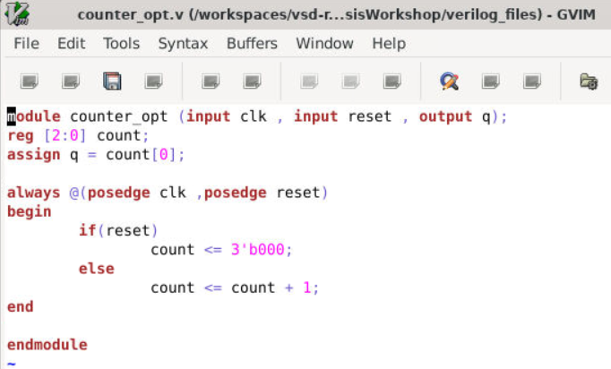
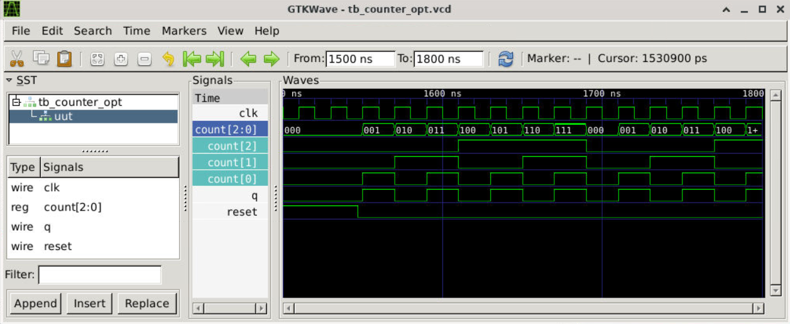
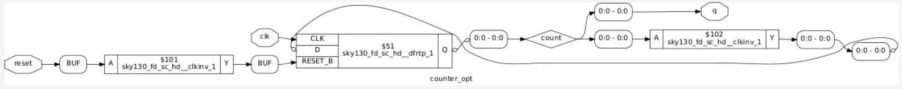
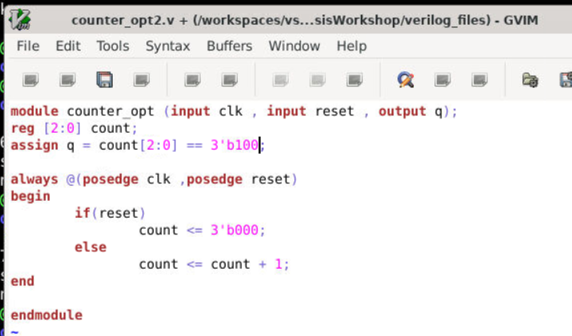
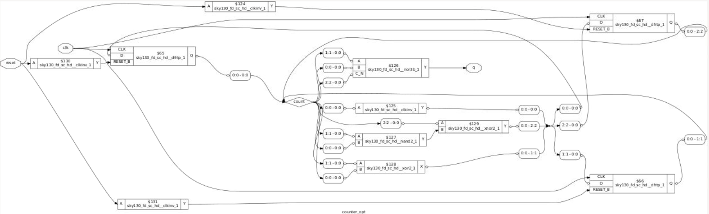

# Day 3 – Combinational and Sequential Optimizations

Welcome to **Day 3** of the RTL Design and Synthesis Workshop using **SKY130 PDK**.
This day focused on understanding how synthesis tools optimize combinational and sequential circuits to improve:

* Area efficiency
* Timing performance
* Power optimization
* Hardware simplification

Using **Yosys**, **Icarus Verilog**, and **GTKWave**, several RTL examples were synthesized and analyzed to observe how redundant logic, unused registers, and constant-driven hardware are optimized automatically.

---

# Table of Contents

1. Introduction to Optimizations
2. Combinational Logic Optimization
3. Sequential Logic Optimization
4. Constant Propagation
5. Multi-Module Optimization
6. Counter Optimization
7. Labs and Results
8. Key Learnings
9. Tools Used
10. Conclusion

---

# 1. Introduction to Optimizations

Optimization in VLSI design refers to simplifying hardware while maintaining the same functionality.

The main goals are:

* Reduce silicon area
* Improve timing
* Reduce power consumption
* Remove redundant hardware
* Generate efficient gate-level netlists

Synthesis tools mathematically analyze RTL and transform it into optimized hardware implementations.

---

# 2. Combinational Logic Optimization

Combinational optimization simplifies Boolean expressions and removes unnecessary logic.

## Concepts Covered

* Constant propagation
* Boolean simplification
* Dead logic elimination
* Multi-module optimization
* Logic reduction

---

# Constant Propagation

Constant propagation replaces variables with constant values during synthesis.

Example:

```verilog
assign y = a ? b : 0;
```

This gets simplified into:

```verilog
assign y = a & b;
```

because selecting between `b` and `0` behaves exactly like an AND gate.

---

---

# Lab – opt_check

## Verilog Code

```verilog
module opt_check (input a , input b , output y);
	assign y = a?b:0;
endmodule
```

## Optimized Result

The synthesis tool converted the logic into a simple AND gate.


## Observation

* Multiplexer logic reduced into AND gate
* Reduced area and gate count
* Demonstrates constant propagation

---

# Lab – opt_check2

## Verilog Code

```verilog
module opt_check2 (input a , input b , output y);
	assign y = a?1:b;
endmodule
```

## Simplified Logic

```verilog
y = a | b;
```

## Optimized Hardware


## Observation

The synthesis tool recognized the logic as an OR operation and replaced the multiplexer with an OR gate.

---

# Lab - opt_check3

## Verilog Code

```verilog
module opt_check3 (input a , input b , input c , output y);
	assign y = a?(c?b:0):0;
endmodule
```

## Simplified Logic

```verilog
y = a & b & c;
```

## Synthesized Output


## Observation

Nested conditional operators were simplified into a 3-input AND gate.

---

# Lab – opt_check4

## Verilog Code

```verilog
module opt_check4 (input a , input b , input c , output y);
	assign y = a?(b?(a & c ):c):(!c);
endmodule
```

## Simplified Logic

```verilog
y = a XNOR c
```

## Synthesized Output


## Observation

Complex nested logic was reduced into a single XNOR gate.

---

# Multi-Module Optimization

Hierarchical designs require flattening before optimization.

Commands used:

```tcl
flatten
opt_clean -purge
```

`opt_clean -purge` removes:

* unused wires
* redundant cells
* dead logic

---

# multiple_module_opt.v

## RTL Code


## Synthesized Output


## Observation

The synthesis tool optimized multiple module instances into a compact gate-level implementation.

Unused intermediate logic and constants were propagated across module boundaries.

---

# multiple_module_opt2.v

## RTL Code


## Synthesized Output


## Observation

Since one module input was tied to constant `0`, several logic paths became redundant and were removed completely.

---

# opt_clean -purge

## Optimization Output


## Observation

Yosys removed:

* unused wires
* redundant nets
* dead logic

This improves hardware efficiency automatically.

---

# 3. Sequential Logic Optimization

Sequential optimization focuses on optimizing:

* flip-flops
* registers
* counters
* state-dependent logic

Unlike combinational optimization, sequential logic depends on previous clock cycles.

---

# Sequential Constant Propagation

If a register output remains constant, synthesis tools remove unnecessary flip-flops.

---

# dff_const1

## Verilog Code
```
module dff_const1(input clk, input reset, output reg q);

always @(posedge clk, posedge reset)
begin
	if(reset)
		q <= 1'b0;
	else
		q <= 1'b1;
end

endmodule
```

##  RTL Screenshot 


## Simulation Output


## Netlist


## Observation

* Reset drives output to `0`
* After reset, output becomes `1`
* Flip-flop is preserved because state dependency exists

---

# dff_const2

## Verilog Code
```
module dff_const2(input clk, input reset, output reg q);

always @(posedge clk, posedge reset)
begin
	if(reset)
		q <= 1'b1;
	else
		q <= 1'b1;
end

endmodule
```

##  RTL Screenshot 


## Simulation Output


## Netlist


## Observation

The output always remains HIGH.

Since:

```verilog
q <= 1'b1;
```

in both conditions, the synthesis tool removed the flip-flop completely.

---

# dff_const3

## Verilog Code
```
module dff_const3(input clk, input reset, output reg q);
reg q1;

always @(posedge clk, posedge reset)
begin
	if(reset)
	begin
		q <= 1'b1;
		q1 <= 1'b0;
	end
	else
	begin
		q1 <= 1'b1;
		q <= q1;
	end
end

endmodule
```

##  RTL Screenshot 


## Simulation Output


## Netlist


## Observation

The output depends on previous clock cycles.

Because of sequential dependency:

```verilog
q <= q1;
```

flip-flops are preserved.

---

# dff_const4

## Verilog Code
```
module dff_const4(input clk, input reset, output reg q);
reg q1;

always @(posedge clk, posedge reset)
begin
	if(reset)
	begin
		q <= 1'b1;
		q1 <= 1'b1;
	end
	else
	begin
		q1 <= 1'b1;
		q <= q1;
	end
end

endmodule
```

##  RTL Screenshot 


## Simulation Output


## Netlist


## Observation

Both `q` and `q1` remain constant HIGH.

The synthesis tool removes unnecessary sequential hardware and replaces outputs with constant logic HIGH.

---

# dff_const5

## Verilog Code
```
module dff_const5(input clk, input reset, output reg q);
reg q1;

always @(posedge clk, posedge reset)
begin
	if(reset)
	begin
		q <= 1'b0;
		q1 <= 1'b0;
	end
	else
	begin
		q1 <= 1'b1;
		q <= q1;
	end
end

endmodule
```

##  RTL Screenshot 


## Simulation Output


## Netlist


## Observation

A one-clock-cycle delay exists because:

```verilog
q <= q1;
```

depends on previous state.

Hence synthesis preserves both flip-flops.

---

# 4. Counter Optimization

Counters are optimized depending on which bits are actually used.

---

# counter_opt

## Verilog Code
```
module counter_opt (input clk , input reset , output q);

reg [2:0] count;
assign q = count[0];

always @(posedge clk ,posedge reset)
begin
	if(reset)
		count <= 3'b000;
	else
		count <= count + 1;
end

endmodule
```

##  RTL Screenshot 




## Simulation Output



## Synthesized Netlist



## Observation

Only:

```verilog
assign q = count[0];
```

is used.

Therefore:

* higher counter bits are removed
* only required hardware is preserved

This demonstrates unused register optimization.

---

# counter_opt2

## Verilog Code
```
module counter_opt (input clk , input reset , output q);

reg [2:0] count;
assign q = count[2:0] == 3'b100;

always @(posedge clk ,posedge reset)
begin
	if(reset)
		count <= 3'b000;
	else
		count <= count + 1;
end

endmodule
```

##  RTL Screenshot 



## Synthesized Netlist



## Observation

The entire counter is required because:

```verilog
assign q = count[2:0] == 3'b100;
```

needs all 3 bits.

Therefore synthesis preserves:

* all flip-flops
* comparator logic
* decoding circuitry

---

# 5. Important Optimization Concepts

## Boolean Logic Optimization

Complex expressions are reduced into minimal gate implementations.

---

## Dead Logic Elimination

Unused:

* wires
* gates
* registers
* modules

are removed automatically.

---

## State Optimization

Equivalent states are reduced to minimize FSM complexity.

---

## Retiming

Registers are repositioned to improve timing performance without changing functionality.

---

## Sequential Logic Cloning

Used in physical-aware synthesis to:

* reduce fanout delay
* improve timing closure
* balance load distribution

---

# Key Learnings

* Synthesis tools optimize RTL mathematically.
* Constant propagation removes unnecessary logic.
* Sequential elements are preserved only when state dependency exists.
* Flattening helps optimization across hierarchical modules.
* Unused wires, registers, and counter bits are automatically removed.
* Optimization improves:

  * area
  * timing
  * power efficiency

---

# Tools Used

* **Icarus Verilog (iverilog)** – Simulation
* **GTKWave** – Waveform Viewer
* **Yosys** – RTL Synthesis
* **SKY130 Standard Cell Library**

---

# Conclusion

Day 3 provided practical understanding of combinational and sequential optimizations in RTL synthesis.

By analyzing:

* RTL code
* simulations
* synthesized netlists
* optimized gate-level implementations

I learned how synthesis tools transform high-level Verilog designs into efficient SKY130 standard-cell hardware using constant propagation, Boolean simplification, dead logic elimination, and sequential optimization techniques.
